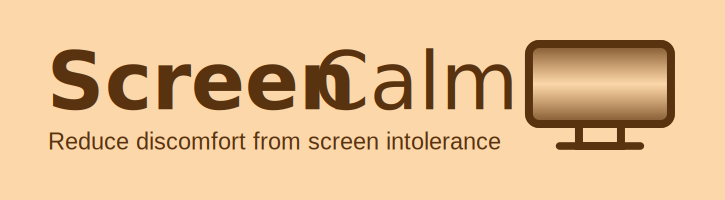

# ScreenCalm

**ScreenCalm** is a Chrome extension that overlays a customizable visual filter on any web page to help reduce discomfort from screen intolerance.

The overlay is designed to mitigate visual triggers such as peripheral motion and harsh contrast, which can contribute to symptoms like dizziness, headaches, or eye strain — particularly for individuals affected by screen intolerance, concussions, or brain injuries.

## 🔧 Overlay Settings

You can adjust the following:

- **Height** of the visible screen area
- **Opacity** of the overlay
- **Edge sharpness**
- **Background blur**
- **Overlay color**

## ⚠️ Disclaimers

- This software does **not** guarantee the prevention or relief of symptoms.
- It is **not a substitute for professional medical advice, therapy, or treatment**.
- If you are experiencing headaches, nausea, dizziness, migraines, or other symptoms, **consult a medical professional**.
- Use this software at your own risk.
- **Immediately discontinue use** if your symptoms worsen.
- Provided "as is", with **no warranties** regarding features, performance, or reliability.

## 🌐 Installation & Browser Compatibility

You can install ScreenCalm from the Chrome Web Store:

**🔗 [TODO: Insert Link to Chrome Web Store]**

ScreenCalm is compatible with all Chromium-based browsers, including (but not limited to):

- Google Chrome
- Microsoft Edge
- Brave
- Vivaldi
- Opera
- Epic Privacy Browser
- SRWare Iron
- Ungoogled Chromium
- Kiwi Browser
- Yandex Browser
- Comodo Dragon
- Avast Secure Browser

## 📝 License

Licensed under the [MIT License](https://mit-license.org/).

## 🤝 Contributions

This is an open source project, and **contributions are welcome and appreciated**!

To improve ScreenCalm:
- Open a pull request
- Submit an issue
- Or contact a project admin

Together we can make screen time more comfortable for more people.
